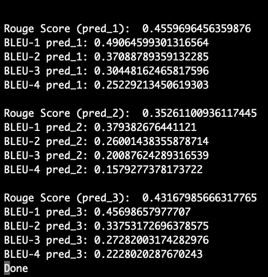
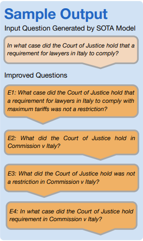

# Towards Improved Question Generation
Question Generation (QG) is an active area of research in the field of Natural Language Processing (NLP) which aims to generate questions based on text passages and offers a multitude of potential applications. With the help of recent advancements in NLP, today’s domain-leading models have made marked strides, as can be observed in many language generation metrics. However, these models have their own flaws. State-of-the-Art (SOTA) models are trained and evaluated on the same dataset. These models suffer in performance when it comes to predictions on a new dataset that was not used during training. Re-training these models on different datasets requires extensive computational resources and time. Thus, we propose a novel dataset that can help test the generalizability of SOTA models along with novel architectures which can act as plug-in components to existing SOTA models, generating improved questions irrespective of the dataset used for training and evaluating the model.

## Evaluation Metric Results

## Sample output
